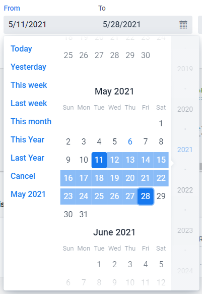

[](https://www.npmjs.com/package/@vaadin-component-factory/vcf-date-range-picker)

[](https://vaadin.com/directory/component/vaadin-component-factoryvcf-date-range-picker)
[](https://vaadin.com/directory/component/vaadin-component-factoryvcf-date-range-picker)

# &lt;vcf-date-range-picker&gt;

[&lt;vcf-date-range-picker&gt;](https://vaadin.com/components/vcf-date-range-picker) is a Web Component providing a date range selection field which includes a scrollable month calendar view.

```html
<vcf-date-range-picker label="Enter date range" value="1990-01-28" end-value="1990-01-30">
</vcf-date-range-picker>
```

[](https://vaadin.com/components/vcf-date-range-picker)

## Running demo

1. Fork the `vcf-date-range-picker` repository and clone it locally.

1. Make sure you have [npm](https://www.npmjs.com/) installed.

1. When in the `vcf-date-range-picker` directory, run `npm install` to install dependencies.

1. Run `npm start` to open the demo.

## Contributing

To contribute to the component, please read [the guideline](https://github.com/vaadin/vaadin-core/blob/master/CONTRIBUTING.md) first.

## License

Apache License 2.0