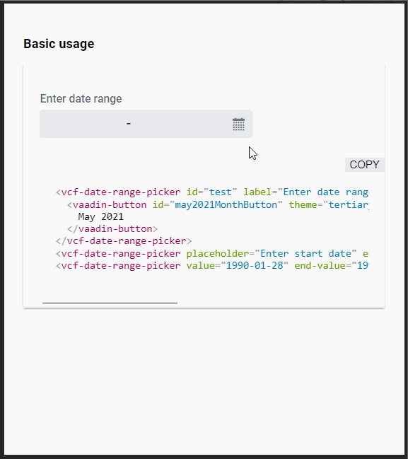

# &lt;vcf-date-range-picker&gt;

[](https://vaadin.com/directory/component/vcf-date-range-picker)

[&lt;vcf-date-range-picker&gt;](https://vaadin.com/components/vcf-date-range-picker) is a Web Component providing a date range selection field which includes a scrollable month calendar view.



## Example Usage
```html
<vcf-date-range-picker label="Enter date range">
</vcf-date-range-picker>
```
